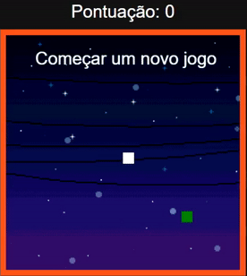
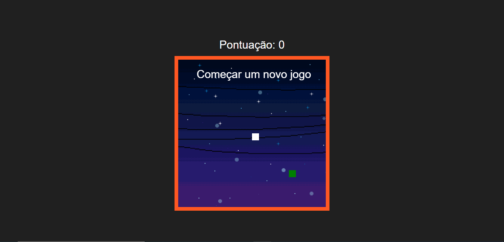
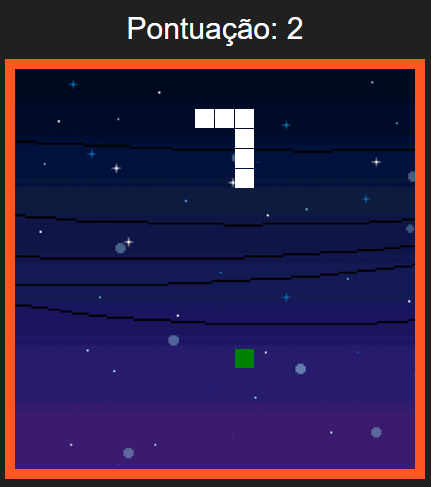

# Jogo da Cobrinha
> Jogo da cobrinha com Javascript, HTML e CSS.

***
Esse jogo foi feito com HTML canvas. Ele possui as funções de mudar de direção, de acordo com as setas do teclado.
O jogo continua mesmo se a cobra passar pela borda, e então ela aparece do lado oposto ao que desapareceu. Possui um contador de pontos que varia de acordo com o número de comidinhas que a protagonista(cobra) comeu.

## Imagens

Abaixo estão algumas imagens do jogo:
***

***

***

